# **
TP 2 : Analyse de la pertinence des stationnements sur l’Île de Montréal.
**

### 
Présenté par :

 Loup Robles

 Ali Tarhini

### 
 Dans le cadre du cours :

 GEO 7630

### 
 Présenté par :

 Clément Glogowski

## Introduction

Ce projet vise à identifier, dans le centre-ville de Montréal, les cases de stationnement qui pourraient être retirées au bénéfice des autres utilisateurs de la voie publique. La voiture occupe trop de place dans le quotidien des Montréalais. Alors que la densité qu’offre une métropole comme celle de Montréal permet de s’orienter vers d’autres modes de déplacement, plus justes environnementalement et socialement.

Ce projet s’insère dans un contexte de changements climatiques et de développement de mobilités durables. Dans cette vision, Montréal et Québec visent la carboneutralité d’ici 2050, avec des objectifs de réduction respectifs des gaz à effet de serre de **55 %** et **37,5 %** d’ici 2030.

Au Québec, on dénombre **trois cases de stationnement par voiture**. Il y a **5 millions** d’automobiles au Québec, ce qui fait environ **15 millions de places de stationnement**. Rien qu’à Montréal, **1 million** de cases de stationnement (dont la moitié sur rue) sont recensées, ce qui représenterait **22 km²**, l’équivalent de l’arrondissement du Plateau-Mont-Royal et de Rosemont - La Petite-Patrie réunis.

## Problèmes causés par l’omniprésence de la voiture

### 🌱 Environnementalement  
Une surabondance de la voiture mène à une surabondance des infrastructures nécessaires à son utilisation. La voirie occupe une grande superficie du territoire et le stationnement représente **27 %** de cette superficie. Plus de routes et de stationnement équivaut à plus de surfaces asphaltées, entraînant des îlots de chaleur urbains.

Toutes les études montrent la corrélation entre la construction d’infrastructures routières et l’augmentation du nombre de véhicules en circulation. Plus on construit de routes, de voies de circulation, de stationnement, plus il y a de véhicules et donc de pollution impactant la qualité de l’air.

### 🚶 Socialement  
- **30 %** des Montréalais ne possèdent pas de voiture, et **30 %** de ceux qui en possèdent se stationnent sur leur terrain privé.
- Le stationnement sur rue, et plus largement les stationnements, représentent de larges espaces occupés par une minorité de personnes.
- L’occupation de ces espaces empêche le développement d’autres modes de transport doux ou décarbonés (pistes cyclables protégées, trottoirs plus larges et agréables, bus en site propre…).

### 💰 Financièrement  
- Une case de stationnement sur rue coûte **1 275 $** par an selon le **Livre blanc sur le stationnement à Montréal**.
- Le stationnement sur rue coûte **près de 600 millions $** à la Ville de Montréal.
- Une partie de ces stationnements est gratuite et donc payée par les contribuables.

### 🔊 Sonore  
- La circulation est l’une des principales sources de bruit en ville : moteurs, klaxons...

### 🎨 Esthétique  
Dernier point à débattre, mais en se projetant, il est probable qu’une écrasante majorité de personnes préfèreraient voir, sur les grands boulevards comme **Saint-Laurent**, de larges trottoirs avec une piste cyclable protégée d’un côté et une rangée d’arbres supplémentaires de l’autre, plutôt que des voies de stationnement des deux côtés.

C’est donc dans ce contexte de réduction du nombre de voitures en ville que s’insère notre projet.

## Méthodologie

Ce projet a été mené sous forme d’**analyse multicritères**. Nous avons mis en place une liste de critères, composés d’un ou plusieurs indicateurs, eux-mêmes composés d’une ou plusieurs données.

Les **indicateurs en jaune** sont ceux que nous n’avons pas pu ou su utiliser, soit en raison de problèmes techniques, soit par manque de temps. Nous n’excluons cependant pas de les inclure ultérieurement pour bonifier notre analyse.

### Hypothèse de travail  
Le postulat était que **là où il y avait une forte circulation** (importance des flux, concentration d’équipements routiers comme les feux de circulation), une bonne desserte en transport en commun, et où les indicateurs environnementaux (pollution de l’air, pollution sonore et îlots de chaleur urbains) étaient négatifs, **les places de stationnement doivent être enlevées**.

---

## Critères et indicateurs

| **Critères**              | **Indicateurs**                                    | **Données** |
|--------------------------|-------------------------------------------------|------------|
| 🌱 **Environnementaux**    | <mark>Pollution sonore                                | <mark> Mesure niveau acoustique |
|                          | Présence d’îlots de chaleur (classe 5)     | Îlots de chaleur 2023 SHP |
|                          | <mark>Qualité de l’air dégradée                        | <mark>Indice de la qualité de l’air |
| 🚗 **Circulation**         | Artères principales                             | Réseau routier |
|                          | <mark>Flux de trafic                                  | <mark>Entrave à la circulation |
|                          | <mark>Feux de circulation                            | - |
|                          | <mark>Déplacements Montréal trajet                   | - |
|                          | <mark>Temps de parcours sur des segments             | <mark>Segments routiers, collecte des temps de parcours |
|                          | <mark>Comptage des véhicules, cyclistes et piétons   | <mark>Intersections munies de feux de circulation |
| 🅿️ **Stationnement**      | <mark>Présence de stationnements gratuits             | <mark>Signalisation stationnement sur rue |
|                          | <mark>Stationnements gratuits et payants              | - |
|                          | Présence de stationnement                       | Stationnements municipaux tarifés, sur rue et hors rue |
| 🚌 **Transport en commun et piétons** | Présence de pistes cyclables utilisées   | Réseau cyclable |
|                          | - | <mark>Comptage des vélos sur la piste cyclable |
|                          | - |  <mark>Réseau express vélo                             |
|                          | <mark>Présence d’une rue piétonne ou partagée        | <mark>Rues piétonnes et partagées |
|                          | Proximité d’un arrêt de bus à forte connectivité | Tracés et arrêts des lignes de bus et de métro |
|                          | Proximité d’une station BIXI fortement utilisée | Historique des déplacements BIXI |

---

Nous n’avons pas réussi à exploiter les données sur **les flux de circulation** en raison de leur méthode de construction **peu pratique**. Nous avons fait face à des problèmes similaires pour les données sur la **pollution sonore**.

Concernant les données sur **la qualité de l’air**, nous avons jugé que les points de relevé étaient trop espacés géographiquement pour être exploitables. De plus, les seuls présents dans notre zone d’étude montraient des résultats de qualité de l’air satisfaisants.

Finalement, nous avons construit les **indicateurs/critères** suivants :

| **Critères**              | **Indicateurs**                                    | **Données** |
|--------------------------|-------------------------------------------------|------------|
| 🌱 **Environnementaux**    | Présence d’îlots de chaleur (classe 5)           | Îlots de chaleur 2023 SHP |
| 🚗 **Circulation**         | Artères principales                             | Réseau routier |
| 🚌 **Transport en commun et piétons** | Présence de pistes cyclables utilisées   | Réseau cyclable |
|                          | Proximité d’un arrêt de bus à forte connectivité | Tracés et arrêts des lignes de bus et de métro |
|                          | Proximité d’une station BIXI fortement utilisée | Historique des déplacements BIXI |

Toutes ces données sont ensuites jointes spatialement aux données de stationnements, afin de vérifier quel stationnement respecte quel indicateur 

| 🅿️ **Stationnement**      | Présence de stationnement                       | Stationnements municipaux tarifés, sur rue et hors rue  |

## FME 

Tous les traitements ont été faits et détaillés sur **notre projet FME** qui est composé de 6 boîtes de traitements :

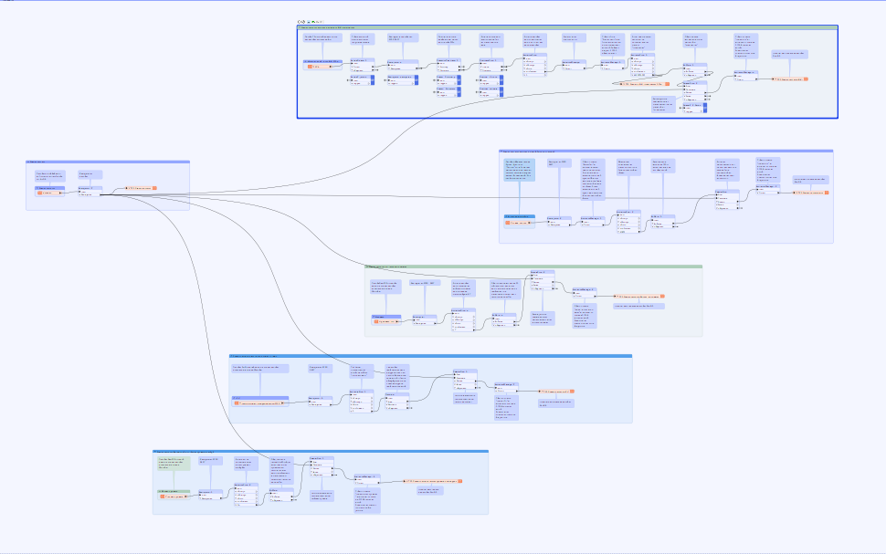

- Stationnements

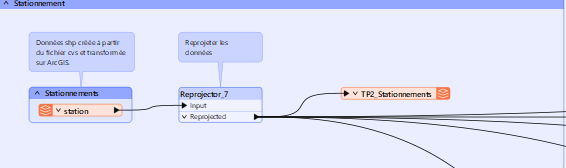

- Stationnements proches de stations BIXI importantes

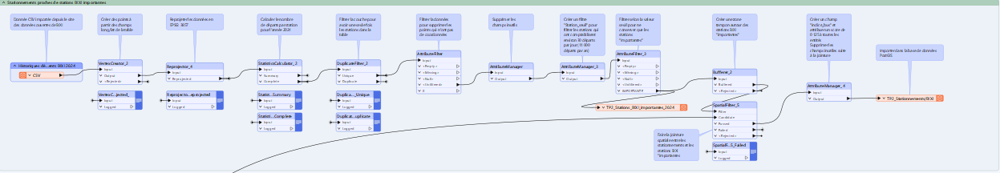

- Stationnements proches de bus à forte connectivité

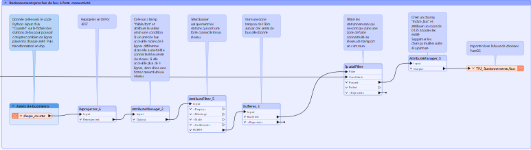

- Stationnements sur routes principales

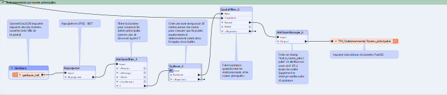

- Stationnements dans Ilots de chaleur urbain

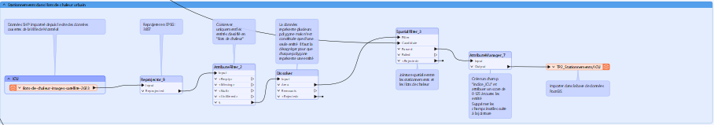

- Stationnements à proximité d'un réseau cyclable protégé

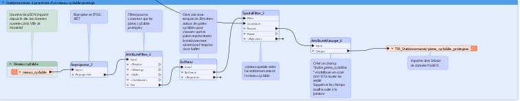

## Création des indices 

Pour la création des indices, nous avons attribuer les valeurs (*arbitraires mais discutable et modifiable*) suivante :
-	Stationnements proches de stations BIXI importantes = **0.125**
-	Stationnements proches de bus à forte connectivité = **0.125**
-	Stationnements sur routes principales = **0.5**
-	Stationnements dans Ilots de chaleur urbain = **0.125**
-	Stationnements à proximité d'un réseau cyclable protégé = **0.125**

Une fois toutes les données ajoutées à **la base de données PostGIS**, nous avons joint successivement, les 5 couches de données mettant en relation le stationnement et un indicateur, avec la donnée des stationnements, de sorte à avoir sur la donnée stationnement les **5 nouveaux champs « indices »** représentant chaque indicateur

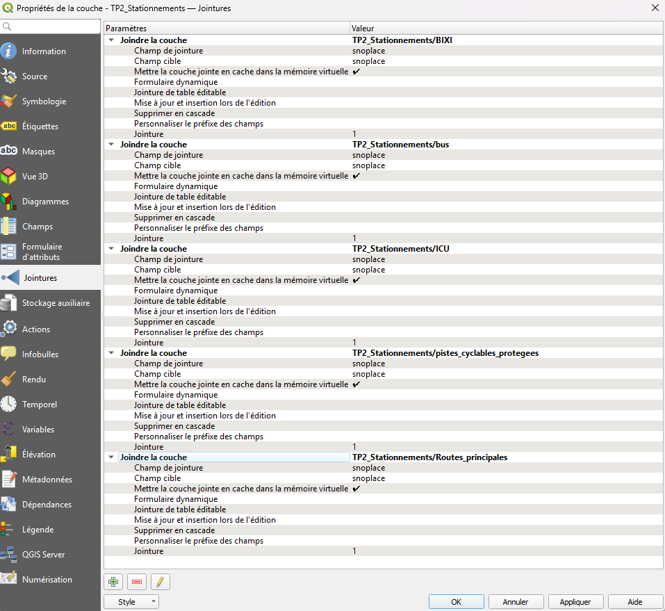

## Derniers traitements

Il a ensuite fallu retravailler la donnée pour transformer chaque indice qui était catégorisé en chaîne de caractères vers des données numériques pour pouvoir les additionner par la suite.

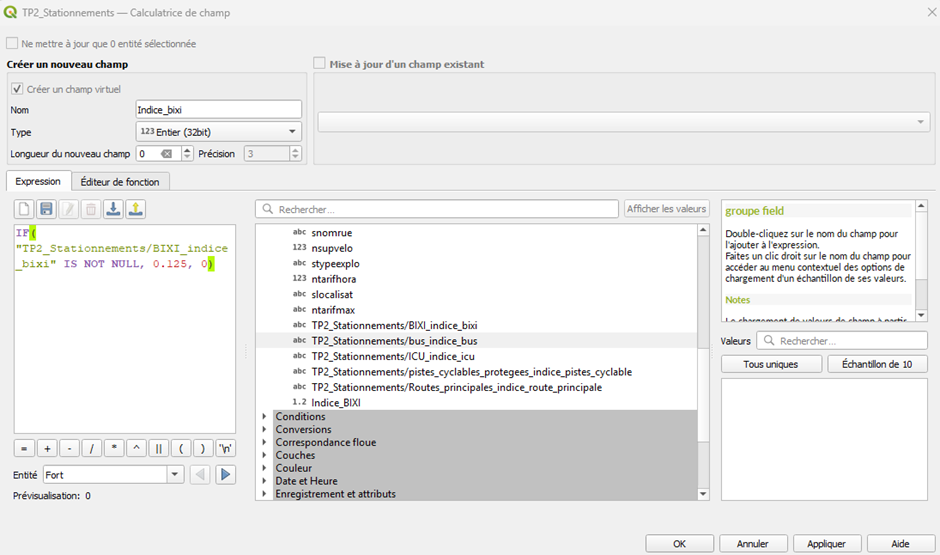

Le résultat de cette addition est stocké dans un nouveau champ nommé « Indice_tot ». Ce champ est utilisé pour cartographier les stationnements 
selon 4 catégories :

- 0 – 0.125 = Faible
- 0.125 – 0.375 = Moyen
- 0.375 – 0.625 = Fort
- 0.625 – 1 = Très fort

## Résultats et analyses

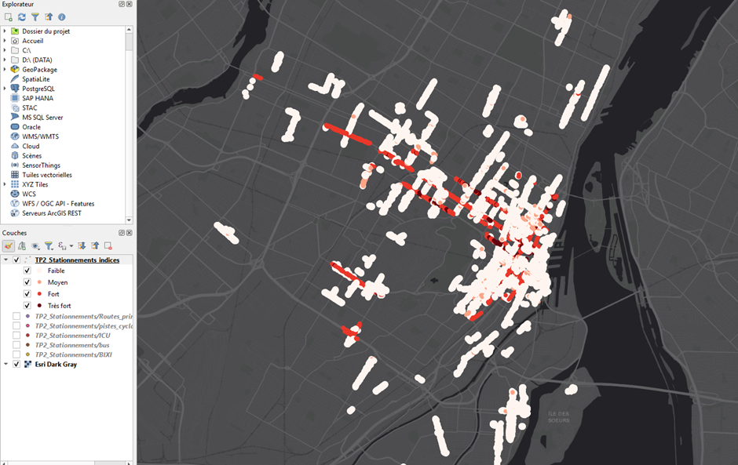

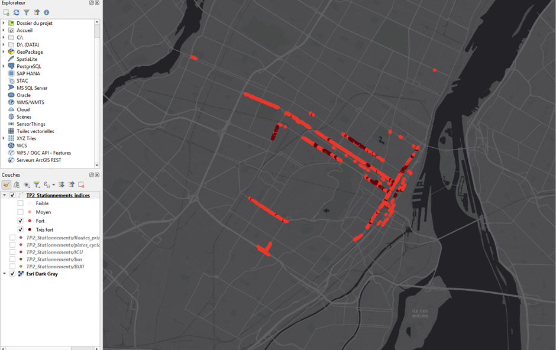

- **3500 stationnements** ont été classés en "Fort" ou "Très fort" impact.

## Conclusion

Les résultats montrent que de nombreuses cases de stationnement pourraient être supprimées pour favoriser des alternatives de transport plus durables et améliorer la qualité de vie urbaine.
