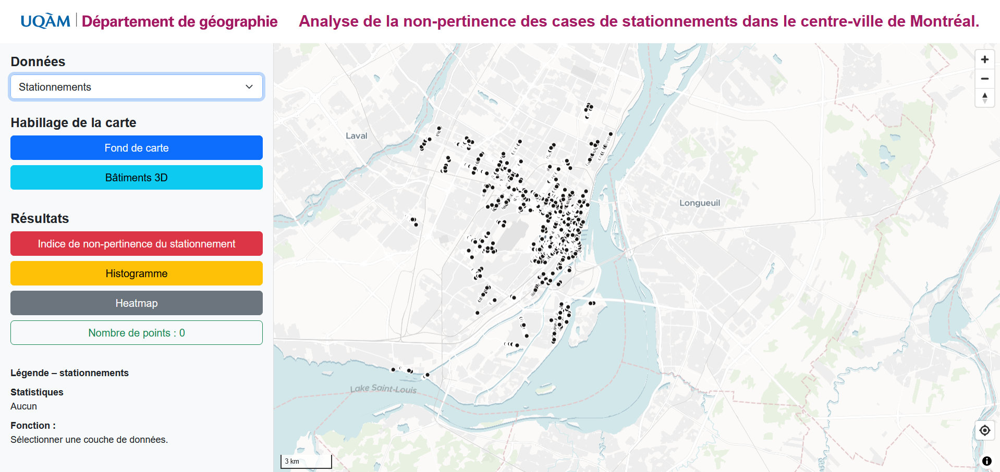
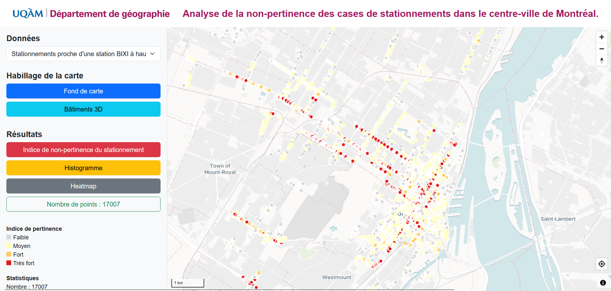
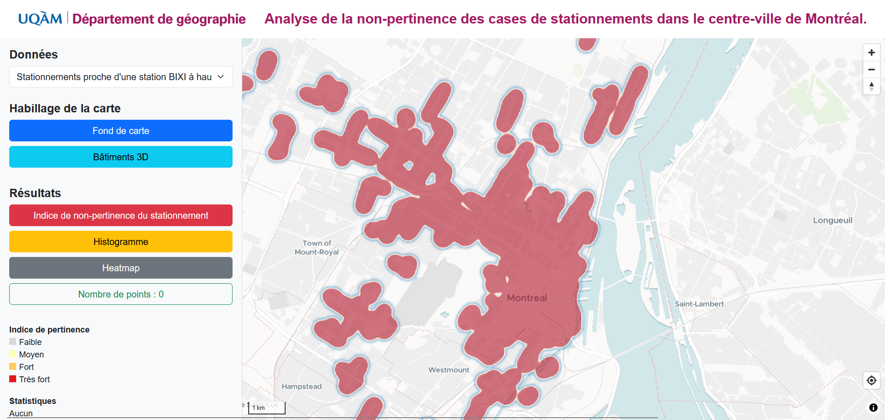

# **
TP 3 : Analyse de la pertinence des stationnements sur l’Île de Montréal.
**

### 
Présenté par :

 Loup Robles

 Ali Tarhini

### 
 Dans le cadre du cours :

 GEO 7630

### 
 Présenté par :

 Clément Glogowski

# Description du projet
-----------------------------------------------------------------------------------------
## Objectif de l'application

Cette application vise à identifier, dans le centre-ville de Montréal, les cases de stationnement qui pourraient être retirées au bénéfice des autres utilisateurs de la voie publique. La voiture occupe trop de place dans le quotidien des Montréalais. Alors que la densité qu’offre une métropole comme celle de Montréal permet de s’orienter vers d’autres modes de déplacement, plus justes environnementalement et socialement.

Ce projet s’insère dans un contexte de changements climatiques et de développement de mobilités durables. Dans cette vision, Montréal et Québec visent la carboneutralité d’ici 2050, avec des objectifs de réduction respectifs des gaz à effet de serre de **55 %** et **37,5 %** d’ici 2030.

Au Québec, on dénombre **trois cases de stationnement par voiture**. Il y a **5 millions** d’automobiles au Québec, ce qui fait environ **15 millions de places de stationnement**. Rien qu’à Montréal, **1 million** de cases de stationnement (dont la moitié sur rue) sont recensées, ce qui représenterait **22 km²**, l’équivalent de l’arrondissement du Plateau-Mont-Royal et de Rosemont - La Petite-Patrie réunis.

## Visualisation de l'application web

Voici à quoi ressemble notre application finale

## Fonctionnalités incluses

### Données
L'application permet de visualiser, à l'aide d'une liste déroulante située dans la catégorie "Données" dans le coin supérieure gauche, les 5 indicateurs que nous avons calculé lors du précédent rendu : 

- 🔥 Les cases de stationnement présentes dans un îlots de chaleur (classe 5).
- 🚗 Les cases de stationnement sur une artère principale.
- 🚌 Les cases de stationnement à proximité d'un arret de bus à forte connectivité (qui acceuille au moins 3 lignes différentes).
- 🚲 Les cases de stationnement à proximité d'une station BIXI fortement utilisée (qui comptabilisent au moins 30 départs par jour, 11 000 par an).
- 🚲 Les cases de stationnement à proximité d'une piste cyclable protégée.

### 🎨 Habillage de la carte
En dessous de cette première catégorie se trouvent plusieurs boutons dont le but est d'habiller la carte :
- 🗺️ Le premier ajoute un fond de carte OpenStreetMap.
- 🏢 Le second ajoute l'empreinte des bâtiments en 3D.

### 📊 Résultats

La 3ème catégorie regroupe 4 boutons :
- 🚫 Un pour afficher notre indice de non-pertinence du stationnement.
- 📈 Un second pour afficher un histogramme dynamique en fonction des données présentes sur l'emprise du canvas.
- 🔥 Un troisième pour faire une carte de chaleur des données (que ce soit l'indice de non-pertinence du stationnement ou les "données").
- 📊 Un dernier pour compter combien il y a d'entité sur l'emprise du canvas.

### Autres fonctionnalités

- En dessous de ces 3 catégories se trouve un encadré nommée "Fonction". Il affiche une description de la données affichée sur la carte pour permettre au lecteur une meilleure compréhension de la carte.
- Lorsque le lecteur clique sur un point de la carte, les attributs de ce point apparaissent.
- Étant donnée que l'empreinte des batiments en 3D est affichable, la carte est inclinable pour pouvoir les visualiser.

## Construction du code

Notre code est construit en 6 fichiers différents :
- ⚙️.env
- app.css
- app.js
- docker-compose.yml
- index.html
- map-controls.js

### Construction du app.js : 

### 🧠 Explication haut niveau du code `app.js`

---

#### 1. 💬 **Popups & Explications**

- Un objet `popup` est utilisé pour afficher des **infos au clic** sur les éléments de la carte.
- Un objet `explanations` contient des **textes d’aide** affichés selon les boutons ou couches sélectionnées.

---

#### 2. 🗺️ **Initialisation de la carte**

- Création de la carte via `maplibregl.Map` centrée sur Montréal.
- Ajout d’une couche raster OpenStreetMap (basemap).
- Ajout d'une source vectorielle pour les **bâtiments 3D**.

---

#### 3. 📂 **Ajout des couches de données**

- Plusieurs couches de **stationnements** sont ajoutées depuis des tuiles vectorielles.
- Chaque couche est double :
  - Un style **cercle** (pour afficher les points).
  - Un style **heatmap** (pour visualiser la densité).
- Certaines couches ont des styles spécifiques (ex : `pertinence-layer` a un code couleur spécial qui correspond à sa symbologie).

---

#### 4. 🖱️ **Interactions utilisateurs**

- 🎛️ **Sélecteur de couche** : change la couche visible selon l’option choisie.
- 🔥 **Bouton heatmap** : alterne entre cercle et heatmap pour la couche active.
- 🗺️ **Bouton basemap** : affiche ou masque le fond OSM.
- 🚫 **Bouton pertinence** : affiche uniquement la couche d’indice de pertinence.
- 🏢 **Bouton bâtiment 3D** : affiche/masque les bâtiments 3D.
- 📊 **Bouton histogramme** : affiche un histogramme si la couche "pertinence" est active.
- 📈 **Bouton stats** : affiche le nombre d’éléments visibles sur la carte.

---

#### 5. ⚙️ **Fonctions utilitaires**

- `updateLegend()` : met à jour la légende selon la couche affichée.
- `updateStats()` : affiche le nombre d’éléments visibles.
- `updateHistogram()` : calcule la répartition des valeurs de pertinence.

---

#### 6. 🔄 **Événements dynamiques**

- **Au déplacement de la carte**, les stats se mettent à jour automatiquement.
- **Au clic sur un point**, un popup affiche ses infos.

Pour cette remise, aucun traitement supplémentaire n'a été effectué. Nous avons utilisé les données produites lors de la remise du TP2.

## Améliorations possibles

- Il faudrait pouvoir choisir quel degrès de non-pertinence des stationnement on souhaite afficher pour que la heatmap ait du sens (pour cette indicateur).
- L'esthétique de la carte peut etre améliorer.
- l'encadré "statistique" pourrait etre retiré, étant donnée que le bouton affiche le nombre d'entités à l'écran.
