# **Laboratoire 10**, Configuration Geoserver et mise en place de services VTS et WFS

## **Étape 1** : Configuration et lancement d’une instance de Geoserver**

Ouvrir un code space depuis le repertoire du cours

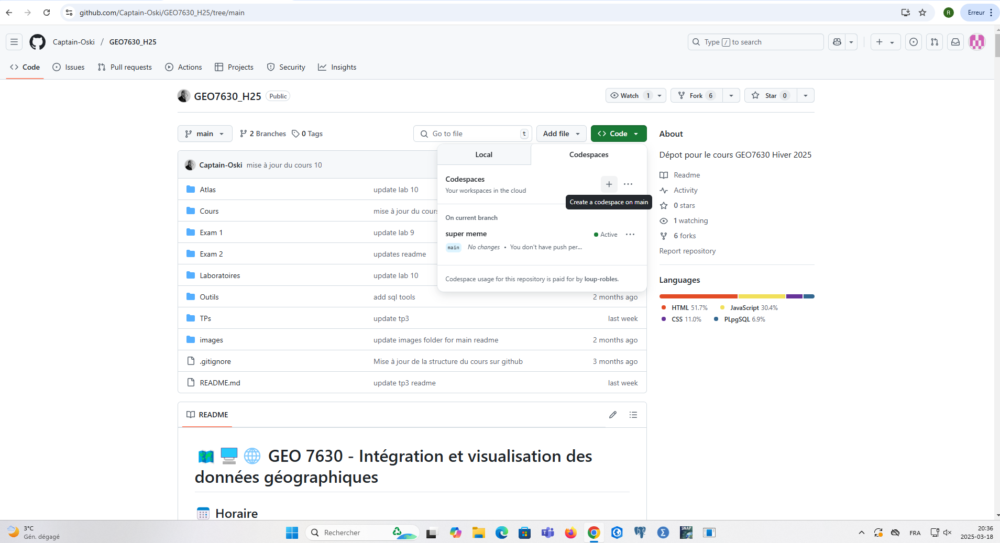

Copier-coller le fichier .env dans l'Atlas, il nous permet de nous connecter à la base de données PostGIS du cours.

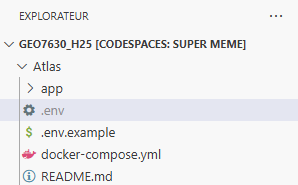

Rentrer les informations

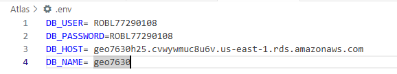

Installer l'exension *Docker*

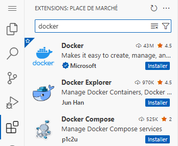

Aller dans Atlas>docker-compose et cliquer sur "Run all services"

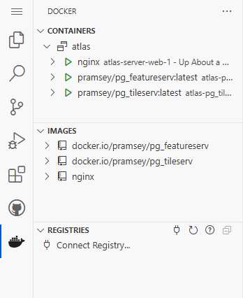

Ouvrir la carte du port8000

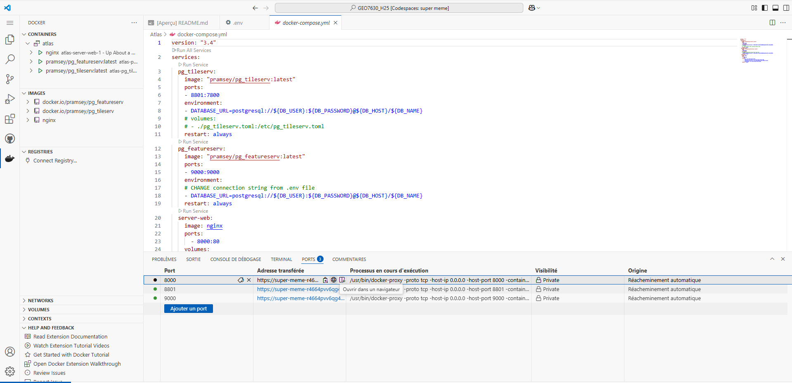
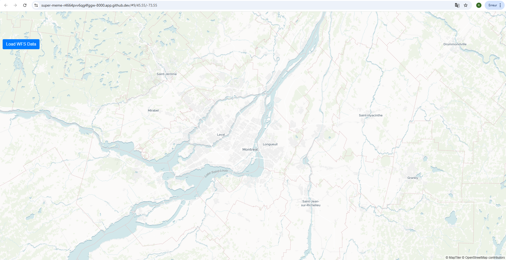

## Étape 2**, Ajout de controle de carte

Copier coller les codes suivants dans Atlas > App > app.js à partir de la ligne 9

- Controle de navigation : 

    var nav = new maplibregl.NavigationControl({
        showCompass: true,
        showZoom: true,
        visualizePitch: true
    });
    map.addControl(nav, 'top-right');

- controle de géolocalisation :

var geolocateControl = new maplibregl.GeolocateControl({
    positionOptions: { enableHighAccuracy: true },
    trackUserLocation: true
});
map.addControl(geolocateControl, 'bottom-right');

- Controle d'échelle : 

var scale = new maplibregl.ScaleControl({ unit: 'metric' });
map.addControl(scale);

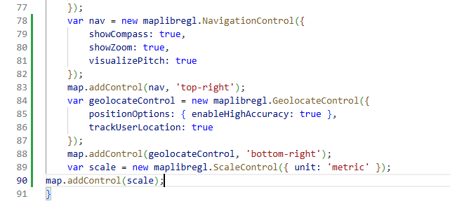

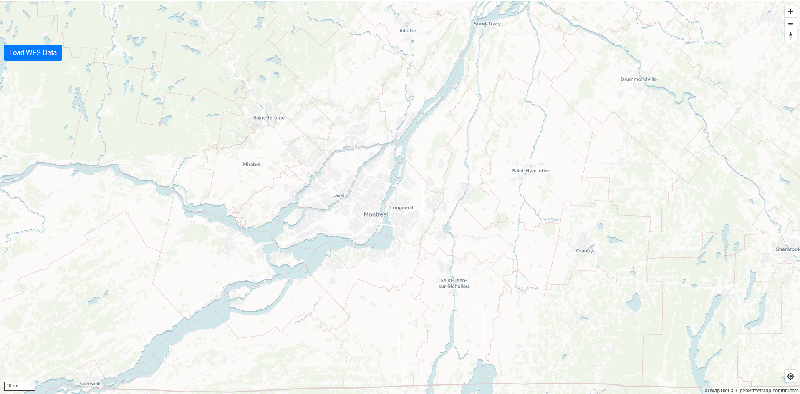

## **Étape 3**, Chargement de données depuis un serveur de tuiles vectorielles

Aller dans le port8801 et ouvrir le fichier JSON de la table *public.densite_arbres_quartiers*

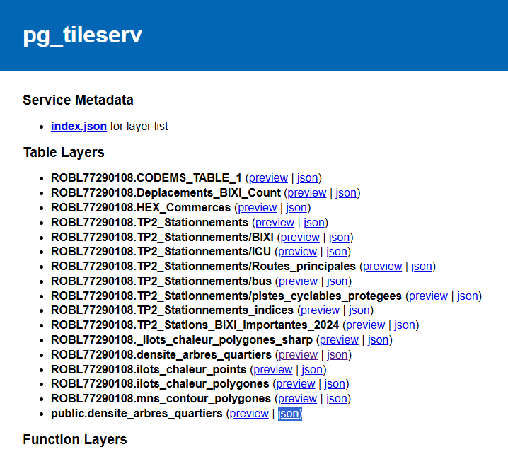

Copier l'url 

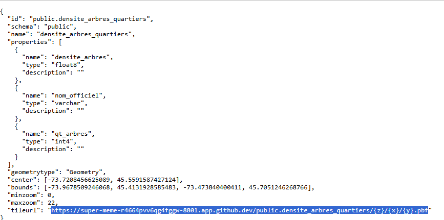

Coller ligne 25 dans "tyle" et vérifier que le "source layer" corresponde à la fin de l'url

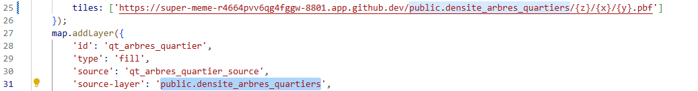

## **Étape 4** (deja présente dans le fichier)

Mettre tous les ports en public pour pouvoir visualiser les données 

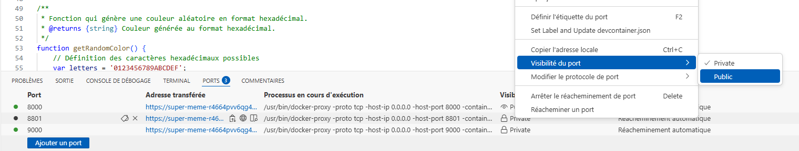

Apparition des tuiles sur la carte

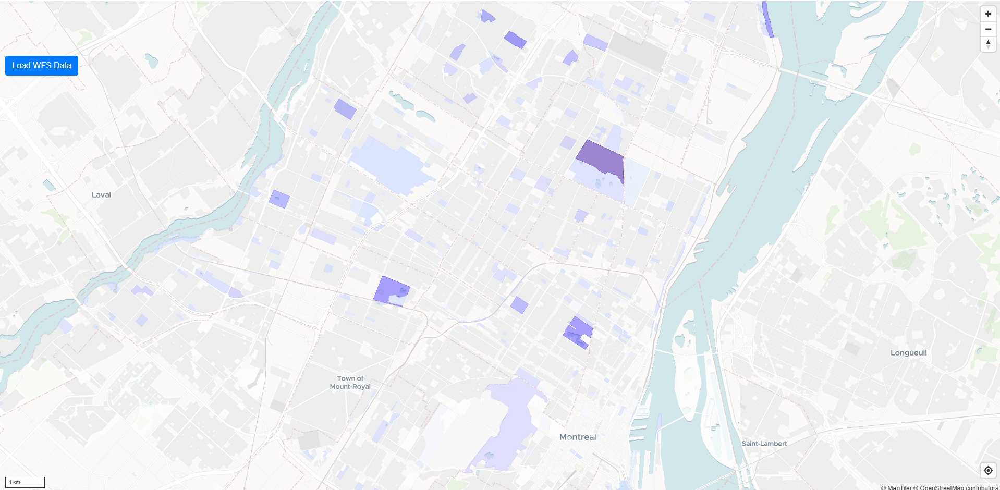

On peut modifier la symbologie de la carte directement dans le code. On change la transparence

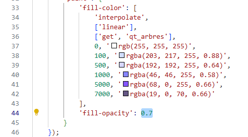

## **Étape 5**, (deja faite dans le code)

## **Étape 6**, Ajout d’une couche WFS

- Télécharger les limites administratives de Montréal depuis le portail des données ouvertes.
- Ouvrir FME et ouvrir la données et ajouter un "writter" PostGIS vers notre base de donnée.
- Nommer la table en sortie "arrondissements"

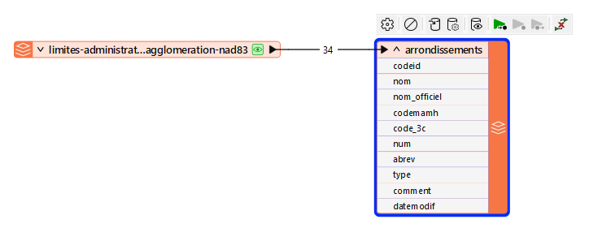

Ouvrir le port9000 > View the collections
Ouvrir la table arrondissements

 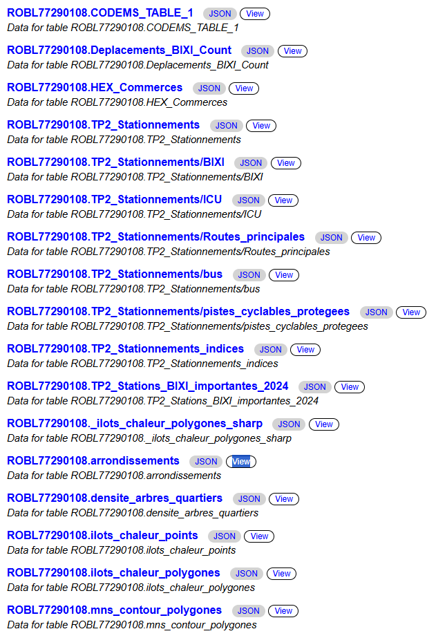

Augmenter la limite d'entité pour pouvoir voir tous les arrondissements

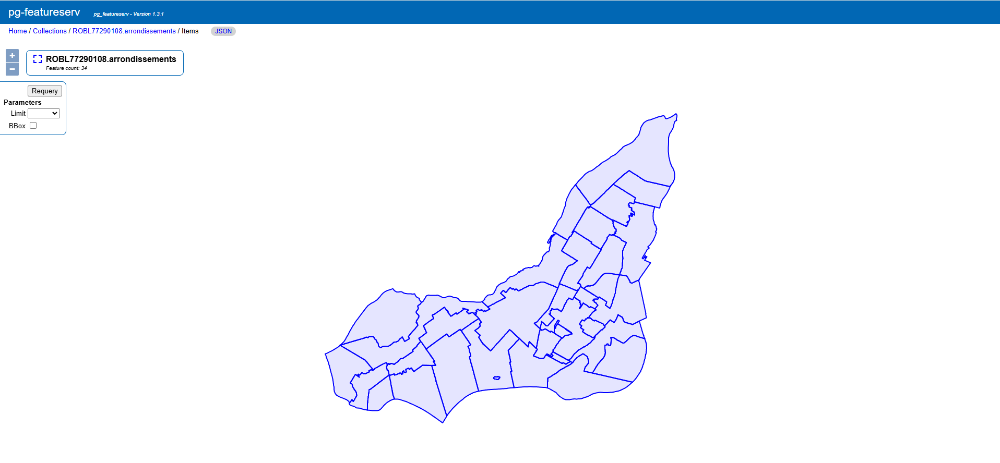

Aller dans le json du fichier pour récupérer tout en bas, l'url 

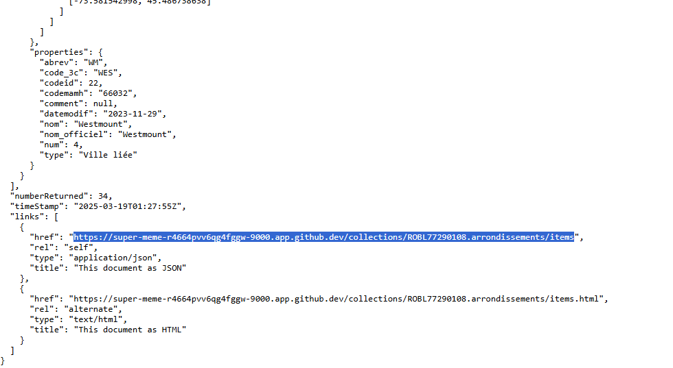

On colle l'url dans le json ligne 76, sans oublier d'ajouter une limite pour pouvoir voir toutes les entités 

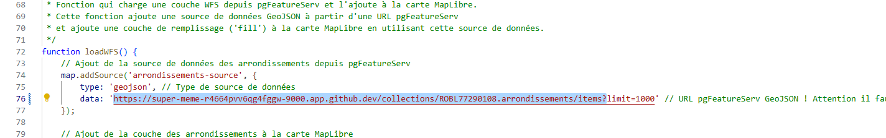

Ajouter un bouton

Sans le code html on a la carte sans bouton
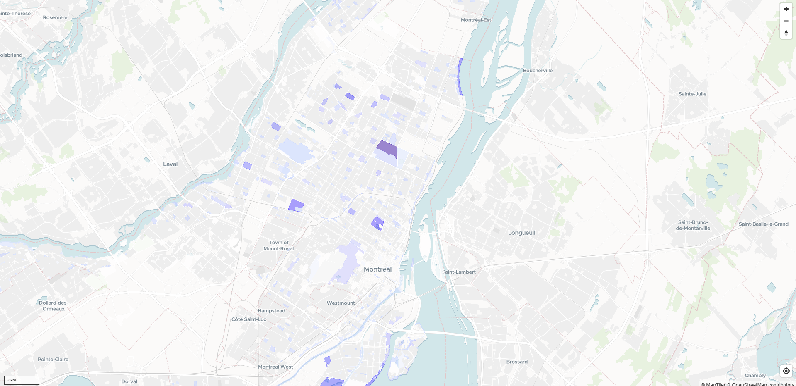

Apres avoir ajouté le code suivant ligne 119 du code html :
    

    <button type="button" class="btn btn-primary" onclick="loadWFS()">Load WFS Data</button>

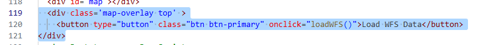

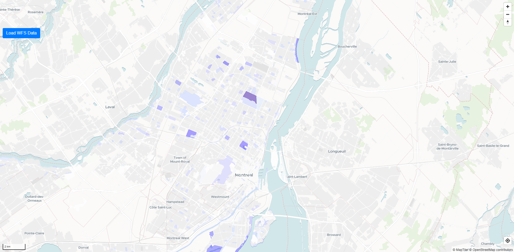

Lorsqu'on appuie sur le bouton, les arrondissements sont ajoutés à la carte.

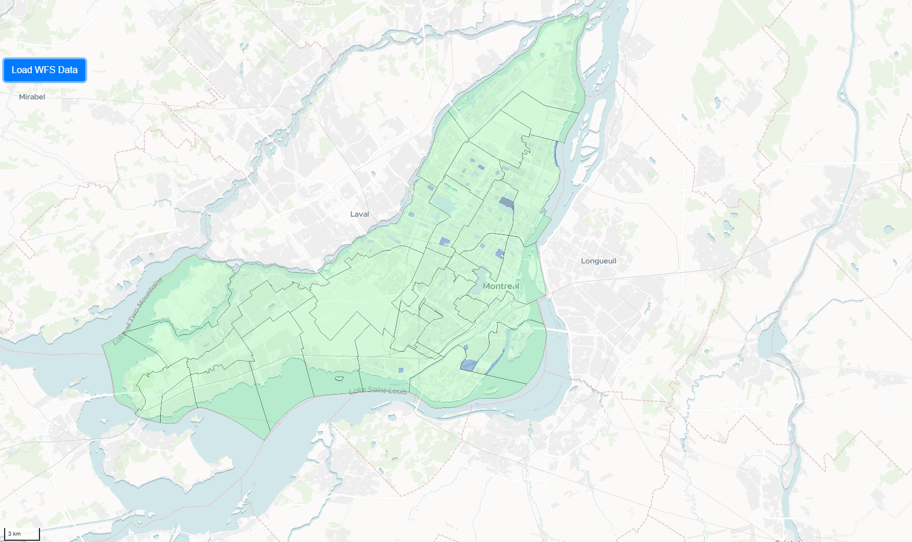 