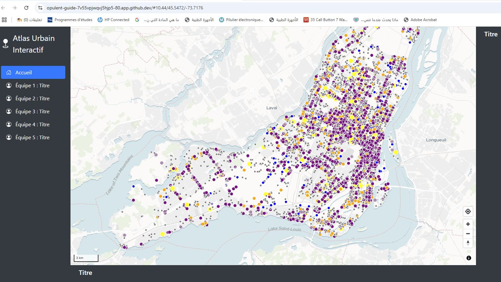
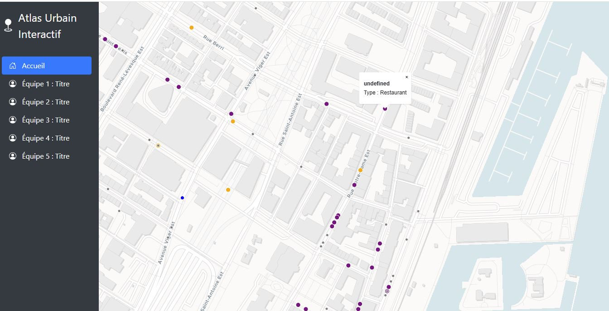

# Laboratoire 11, Création d'une carte interactive web

## Étape 1 : configuration des fichiers

Apres avoir ouvert un codespace du repertoire de Clément, on créer dans ce dernier un nouveau dossier "semaine 11". On y ajoute les fichiers : 
- .env (qu'on copie-colle depuis le dossier "Atlas", utilisé lors du précédent lab)

- .yml, le docker compose, lui aussi copié depuis le dossier Atlas et utilisé la semaine derniere mais on modifie le code des *volumes*

- map-controls.js, dans lequel on initialise la carte en y ajoutant les objets suivants :
    -  Création de la carte (maplibregl.Map)
    -  Ajout de controle de géolocalisation
    -  Ajout de contrôle de navigation (zoom, boussole)

!!! aller dans le `.html` pour y référer notre fichier `map-controls.js`

# Étape 2, Ajout des couches de données

créer un fichier `map-layers.js` pour y créer les layer sous forme de variables.
On ajoute pour chaque données, une variable pour ajouter la source, puis une seconde pour ajouter la couche (liée à la source)

Comme ici pour la donnée *arrondissements*

  var arrSource = {
    type: 'geojson',
    data: 'https://special-train-.../collections/public.arrondissements/items?limit=5000'
  };
  
  var arrondissementsLayer = {
    id: 'arrondissements',
    type: 'fill',
    source: 'arrondissements-source',
    paint: {
      'fill-color': 'rgba(200,200,200,0.4)',
      'fill-outline-color': 'black'
    }
  };
  
On ajoute, en plus des arrondissements la données des *commerces*

## **Étape 3**, Chargement des couches dans la carte

Les couches sont chargées sur la carte depuis le fichier *app.js*.
Elles sont ajoutées avec la fonction *map.on('load',())*

map.on('load', function () {
    map.addSource('commerces_source', commercesSource);
    map.addLayer(commercesLayer);
  
    map.addSource('arrondissements-source', arrSource);
    map.addLayer(arrondissementsLayer);
    map.addLayer(arrondissementsLabel);
  });

## **Étape 4**, Ajout des interactions souris

Il faut ensuite ajouter les interaction avec le curseur de la souris. On veut pouvoir cliquer sur les données des commerces et qu'un popup s'affiche avec des informations.

Cette fois-ci c'est la fonction *map.on('click', 'CoucheQuiInteragit')

map.on('click', 'commerces', (e) => {
    var coords = e.features[0].geometry.coordinates;
    var props = e.features[0].properties;
  
    new maplibregl.Popup()
      .setLngLat(coords)
      .setHTML(`<strong>${props.nom}</strong> Type : ${props.type}`)
      .addTo(map);
  
    map.flyTo({ center: coords, zoom: 14 });
  });

## **Étape 5**, Visualisation

