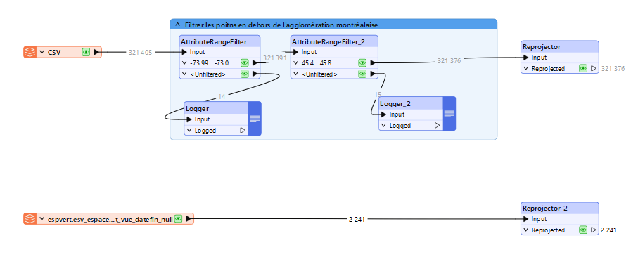
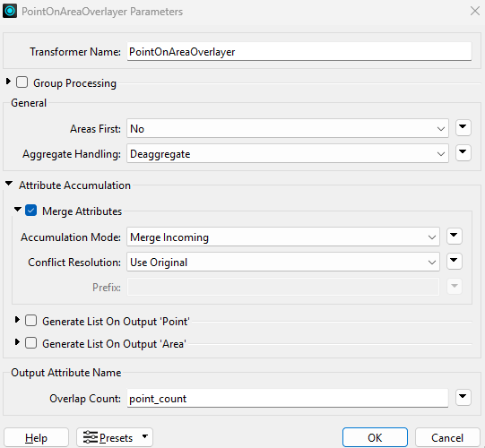
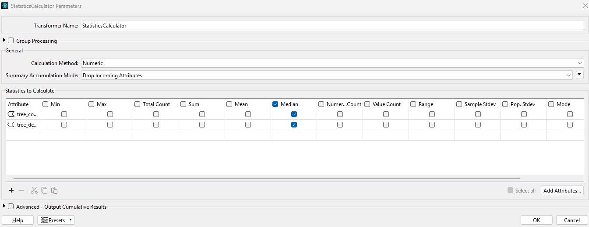

# 🌳 Laboratoire 3 : Optimisation de la densité d’implantation d’arbres dans les parcs de Montréal (problématique fictive)

## **Étape 1**, ajouter les données au Workbench FME**

Les données de ce troisième laboratoire étant similaires à celles du second, j'ai repris le même FME dans lequel j'ai conservé la donnée des arbes. Pour rappelle nous avions filtré le fichier CSV pour ne conserver que les lattitudes/longitudes concernées par Montréal et reprojeté les points en EPSG: 32188.
La seconde donnée n'est ici plus les limites d'arrondissements de l'île mais les parcs. Ils sont ajoutés au workbench avec un reader Geojson avant d'être reprojetés.

## **Étape 2**, jointure spatiale**

la joiture spatiale s'effectue avec le transformer *PointOnAreaOverlayer* avec les régalges suivants. cette outils va permettre de comptabiliser le nombre d'arbres présent dans chaque parcs.

Après avoir effectuée la jointure, tous les champs des deux données se retrouvent dans la table attributaire sortante. *AttributeManager* permet de nettoyer la donnée résultante de la jointure.

## **Étape 3**, calcule de la médiane de densité

Contraitement au lab2 ou nous avions utilisé *AttributeCreator* pour créer le champs "tree_density", je l'ai crée pour ce lab dans le *AttributeManager*.

 Pour calculer la médiane des variables "tree_count" et "tree_density", le Transformer *StatisticsCalulator* est ajouté.

 ## **Étape 4**, calcule de l'index par rapport à la moyenne

Cet index permet de normaliser les données et d'identifier les parcs dont le nombre d'arbres est significativement au dessus de la moyenne.

## **Étape 5**, nettoyage des données

À l'aide d'un *NullAttributeManager* on remplace les cellules qui comportent des valeurs nulles ou des caractères spéciaux par "Null".

## **Étape 6**, visualisation des données sur QGIS

L'ajout d'un *Writter* vers notre base de données Postgis permet d'exporter notre notre couche dans la base de données. On peut ensuite l'ouvrir dans QGIS et la visualiser avec une symbologie adaptée.

