# **📚 Laboratoire 4**, Intégration Matricielle FME + QGIS
## **Préparation du laboratoire, ajouter les données**

Après avoir téléchargé les données on les drag and drop dans le FME pour ajouter des readers. Les données sont composées de :
- Un raster analytique - Ilots de chaleur
- Une image aérienne - Ville-Marie
- Un MNS - Ville-Marie de résolution 1m

Pour ce laboratoire, le rapport sera divisé en 3 parties, une par donnée. Chaque partie détaillera les opération effectuées sur chaque données. Pour créer un FME ordonné on créer pour chaque reader un bookmark du nom de la donnée.

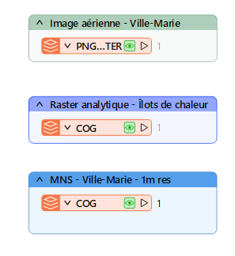

# 📜 **Parti 1** : intégration de l'image aérienne**

## 📝 **Étape 1**, extraire les propriétés de l'image

On commence par reprojeter la donnée avant d'utiliser le transformer "RasterPropertyExtractor" qui extrait les propriétés géométriques du raster et les transforme en attributs.

## 📝 **Étape 2**, redimensionner l'image

Le transformer "RasterResampler" est utilisé pour redimensionner l'image aérienne. Il est utile pour modifier la résolution spatiale, la taille ou la géométrie de l'image. Pour les paramètres, on divise le nombre de lignes et de colonnes par 10. 

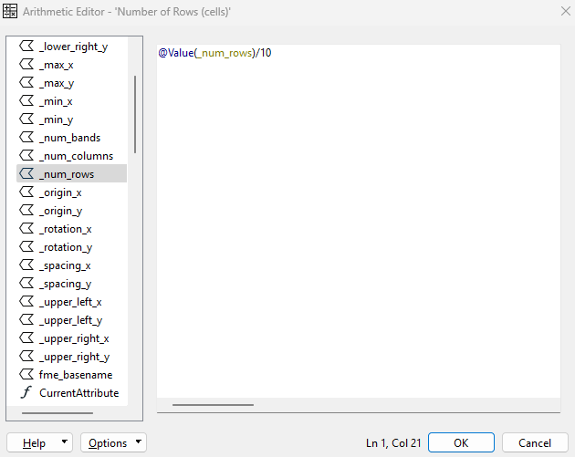

## 📝 **Étape 3**, créer une série de pyramides raster

RasterPyramider est un transformer qui permet, à partir d'un raster, de créer une série de raster dont la résolution diminue d'image en image. 10 images sont ainsi créees.

## 📝 **Étape 4**, connecter le résultat à Postgis

Le featureWritter est préféré au simple writter ici. Il permet de chainer les actions les unes à la suite des autres. il faut cependant ajouter un "SQLExecutor" pour pouvoir créer une table dans notre base de donnée dans laquelle sera stocké l'image.

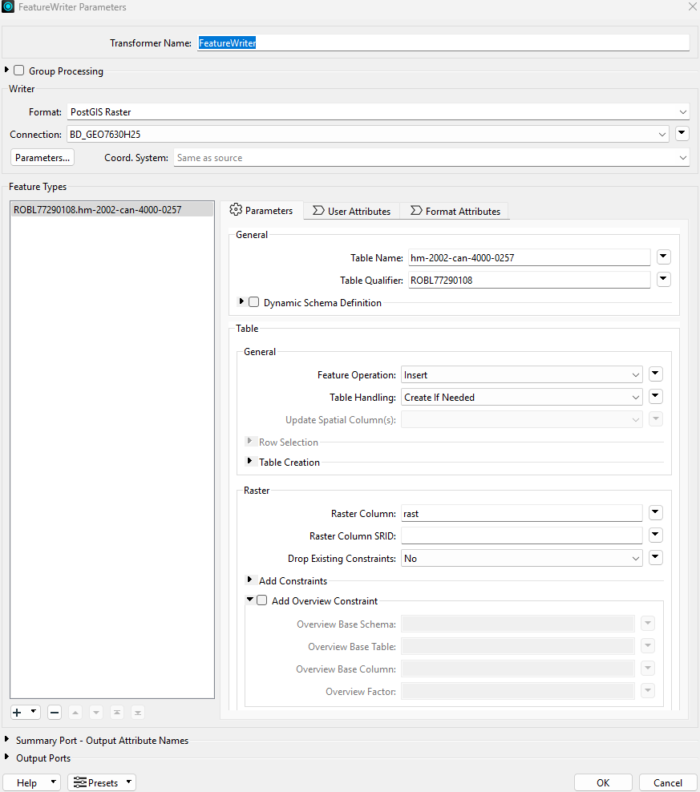

📢 **ATTENTION**: il faut faire attention à modifieir  rensiegner son code MS dans la commande SQL et d'ajouter des guillemets.

## 📝 **Étape 5**, visualisation

On peut desormais visualiser notre raster dans QGIS en se connectant à la base de donnée PostGIS. La visualisation sur QGIS ne se fait pas a cause d'une erreure dans le SQLExecutor mais si on arrete le processus après le FeatureWritter on voit le résulat.

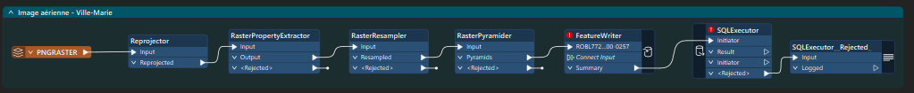

# 📜 **Partie 2** : intégration du raster analytique des îlots de chaleurs**

## 📝 **Étape 1**, vectoriser l'image

"RasterToPolygonCoercer" permet de convertir l'image raster en entités vectorielles polygonales en créant un chanp qui conserve la valeur de leur pixel d'origine. Cette attribut se nomme "classification".

## 📝 **Étape 2**, retranscrire le résultat dans PostGIS et visualisation dans QGIS

On exporte le résultat dans la base de donnée PostGIS avec un writter pour pouvoir visualiser le résultar dans QGIS. Une fois la symbologie modifiée et enregistrée on obtient le résultat suivant :

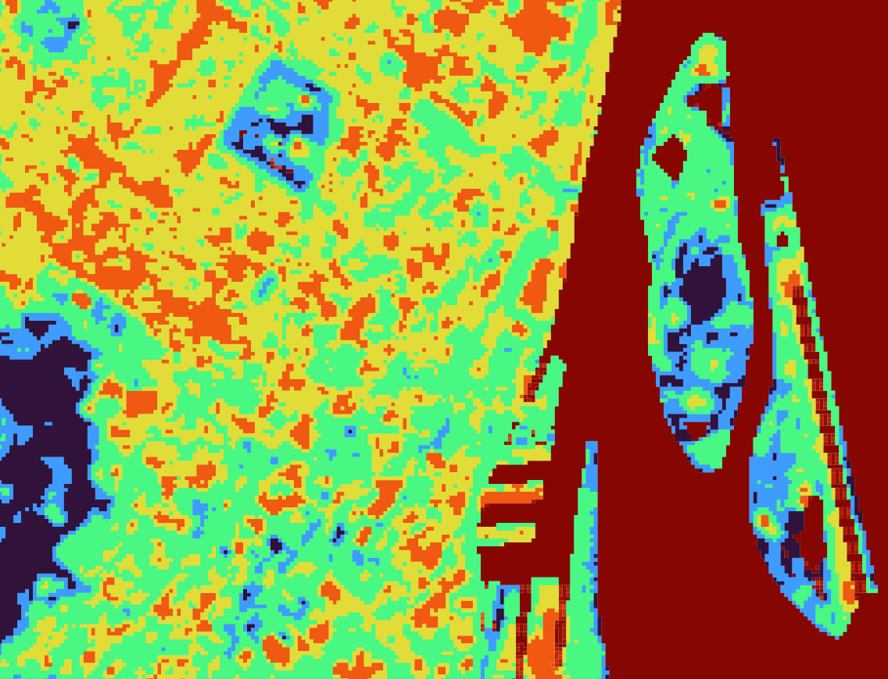

## **Étape 3**, affiner le résultat

Le transformer "RasterToPolygonCoercer" créer un résultat assez grossier lors de la vectorisation. Pour l'affiner on utilise la séquence de traitement suivante :

- RasterDiffuser : qui se place après le Reprojector et qui diffuse les contour de chaque pixel
- RasterCellValueRounder : arrondit les valeurs des cellules
- RasterToPolygonCoercer : qui vecteurise le raster modifié par les précédents traitements

Résultat affiné  :

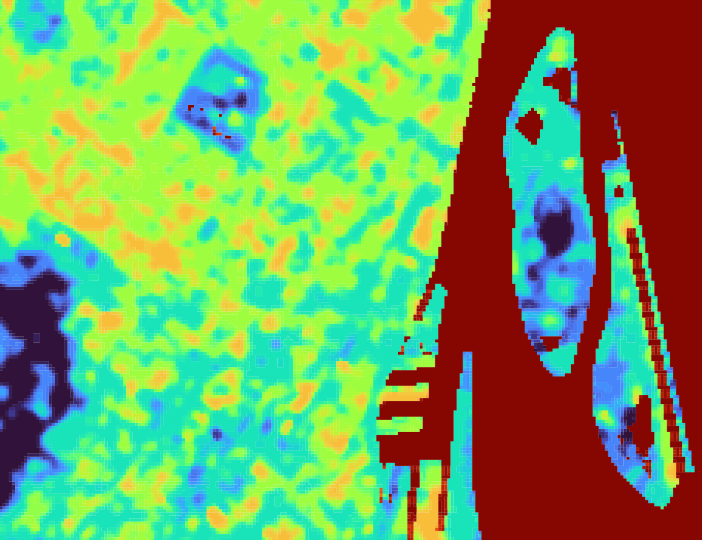

## **Étape 4**, visualiser les îlots de chaleurs sous forme de points

Le transformer "RasterCellCoercer" créer un point individuel pour chaque pixel de l'image. On paramètre l'outils pour qu'il prélève la auteur des points

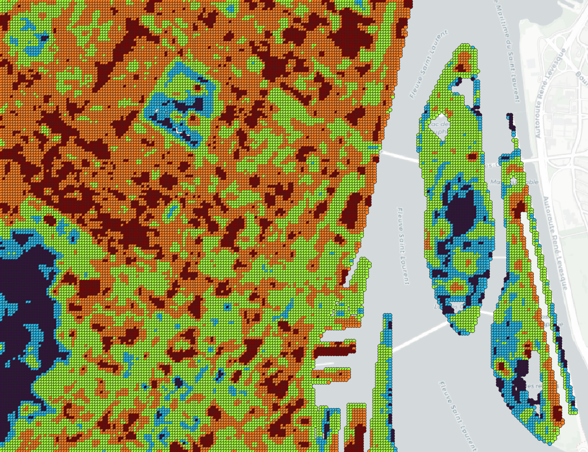

FME de cette partie : 

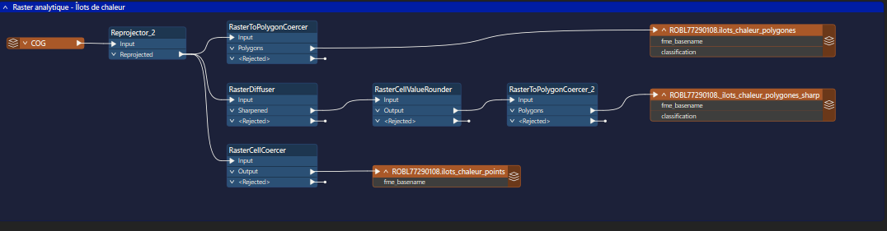

# 📜 **Partie 3** : Intégration de raster MNS

## **Étape 1**, Générer des contours de surface selon leur élévation

Le transformateur "ContourGenerator" dans FME est utilisé pour créer des lignes de contour à partir d'une surface raster, représentant des niveaux d'altitude à intervalles réguliers

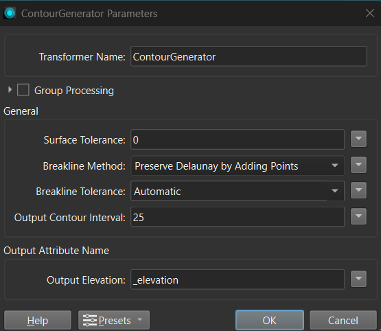

le nombre de vertex est simplifié avec *Generalizer*

Certains contours ne sont pas "fermés". On ne peut pas en créer des polygones. *AreaBuilder* permet de créer des polygones à partir des contours en fermant les vertex qui ne sont pas connectés.

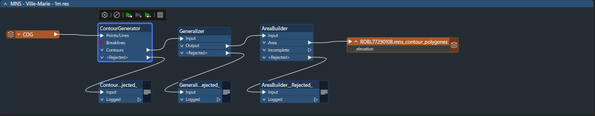

## **Étape 2**, visualisation QGIS 

On peut faire une jointure pour ajouter l'élévation aux polygones et faire la symbologie selon ce champ.
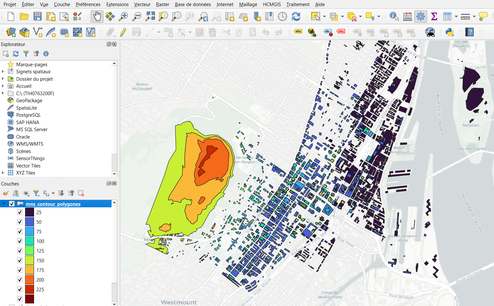