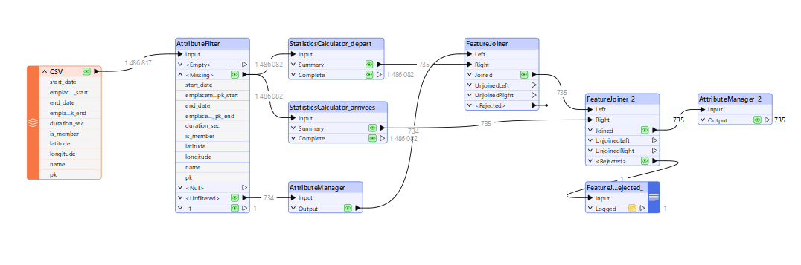
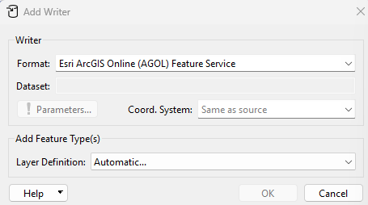
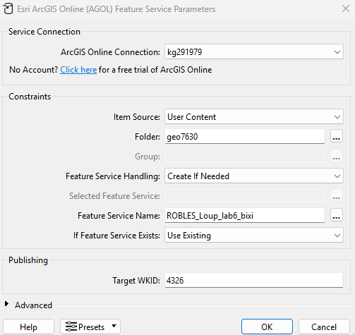

# **📚 Laboratoire 6**
## **Étape 1, prise en main de GitHub**
ajout des données CSV depuis le liens suivant : https://sitewebbixi.s3.amazonaws.com/uploads/docs/20220107-donnees-ouvertes-8aa623.zip
Beaucoup d'entité non pas de coordonnées renseignées. On les filtre celles qui ont une longitude de -1 pour exclure les points qui n'ont pas de coordonnées et ceux qui en ont mais qui sont eronées.

## **Arcgis online**

- créer un nouveau dossier dans Arcgis Online (Contenue>dossier>créer un nouveau dossier)
- ajouter un Writter pour push les données dans ArcGIS online selon les paramètre suivants :

   

ATTENTION !!! Le feature service name doit etre unique sur Arcgis Online. Il faut le nommer de facon à ce qu'aucun autre feature service n'est le meme nom.

- Sur Arcgis Online, ouvrir notre données dans Map Viewer

- Dans aggrégation, choisir aggrégation et non regroupement.
- Dans style, ajouter un champ et selectionner srart_total_count et end_total_count puis dans le choix de style sélectionner Comparer A à B. Dans option de style, choisir les étiquettes "Afficher A comme pourcentage de A et B".
- créer un dashboard
- Ajouter notre carte 